# Weather App

This project implements a simple web application that displays current weather information for a given city. Users can enter a city name, and the application will fetch and display details such as temperature, humidity, wind speed, and general weather conditions.

## Features

*   **City Search:** Input a city name to get its current weather.
*   **Comprehensive Display:** Shows temperature, humidity, wind speed, and weather conditions.
*   **Error Handling:** User-friendly messages for invalid city names, empty input, and API errors.
*   **Responsive Design:** Adapts to various screen sizes.

## Architecture

The application follows a client-server architecture:

*   **Frontend:** Built with HTML, CSS, and JavaScript, providing the user interface.
*   **Backend:** A Flask application that serves as an API endpoint (`/api/weather?city=`) to fetch weather data.
*   **External API:** Integrates with the Open-Meteo API for weather data retrieval.

```graphviz:dot
digraph G {
    rankdir=LR;
    node [shape=box, style="filled", fillcolor="lightblue"];

    subgraph cluster_user {
        label="User";
        "User" [shape=none, label="Web Application User"];
    }

    subgraph cluster_frontend {
        label="Frontend (Web Browser)";
        "User Interface" [label="User Interface\n(HTML, CSS, JavaScript)"];
    }

    subgraph cluster_backend {
        label="Backend (Application Server)";
        "Backend Service" [label="Weather API Endpoint\n(/api/weather)"];
        "External API Client" [label="External Weather API Client"];
    }

    subgraph cluster_external {
        label="External System";
        "External Weather API" [label="Open-Meteo API"];
    }

    "User" -> "User Interface" [label="Interacts with"];
    "User Interface" -> "Backend Service" [label="HTTP Request\n(City Name)"];
    "Backend Service" -> "External API Client" [label="Internal Call"];
    "External API Client" -> "External Weather API" [label="HTTP Request\n(Lat/Lon)"];
    "External Weather API" -> "External API Client" [label="Weather Data (JSON)"];
    "External API Client" -> "Backend Service" [label="Parsed Weather Data"];
    "Backend Service" -> "User Interface" [label="Weather Data (JSON)\n/ Error Message"];
    "User Interface" -> "User" [label="Displays Data/Errors"];
}
```



## Setup and Local Development

Follow these steps to set up and run the application locally.

### Prerequisites

*   Docker (recommended for easy setup)
*   Python 3.9+ (if running backend directly)
*   `pip` (if running backend directly)

### 1. Clone the Repository

```bash
git clone https://github.com/p67428378-afk/weather-app.git
cd weather-app
```

### 2. Run with Docker (Recommended)

This method uses Docker to containerize and run both the frontend and backend services.

1.  **Build the Docker Image for the Backend:**

    ```bash
    docker build -t weather-app-backend ./backend
    ```

2.  **Run the Backend Container:**

    ```bash
    docker run -p 5000:5000 weather-app-backend
    ```

    The backend API will be available at `http://localhost:5000/api/weather?city=YOUR_CITY`.

3.  **Serve the Frontend:**

    Open the `static/index.html` file directly in your web browser. Since the frontend makes requests to `/api/weather`, it will automatically route to the backend running on `localhost:5000` if accessed from the same origin (or if a proxy is configured, which is not needed for direct file access + backend on localhost).

    Alternatively, you can use a simple Python HTTP server to serve the static files:

    ```bash
    cd static
    python -m http.server 8000
    ```

    Then, open `http://localhost:8000` in your browser.

### 3. Run Backend Directly (Without Docker)

1.  **Navigate to the backend directory:**

    ```bash
    cd backend
    ```

2.  **Create and activate a virtual environment (optional but recommended):**

    ```bash
    python -m venv venv
    source venv/bin/activate  # On Windows: .\venv\Scripts\activate
    ```

3.  **Install dependencies:**

    ```bash
    pip install -r requirements.txt
    ```

4.  **Run the Flask application:**

    ```bash
    flask run --host=0.0.0.0 --port=5000
    ```

    The backend API will be available at `http://localhost:5000/api/weather?city=YOUR_CITY`.

5.  **Serve the Frontend:**

    As described in step 3 of the Docker instructions, open `static/index.html` directly or use a simple HTTP server.

## Usage

1.  Ensure both the backend and frontend are running.
2.  Open `static/index.html` (or `http://localhost:8000` if using a local server) in your web browser.
3.  Enter a city name (e.g., "London", "Paris", "Tokyo") into the input field.
4.  Click the "Search" button or press Enter.
5.  The current weather information for the entered city will be displayed.
6.  If the city is not found or there's an API error, an appropriate error message will be shown.

## API Reference (Backend)

### `GET /api/weather`

Retrieves current weather information for a specified city.

#### Query Parameters

*   `city` (string, required): The name of the city.

#### Example Request

```
GET /api/weather?city=London
```

#### Example Success Response (200 OK)

```json
{
    "city": "London",
    "temperature": "15.2°C",
    "humidity": "N/A",
    "wind_speed": "10.8 km/h",
    "conditions": "Partly cloudy"
}
```

#### Example Error Response (400 Bad Request)

```json
{
    "error": "Please enter a city name"
}
```

#### Example Error Response (404 Not Found)

```json
{
    "error": "City not found or no weather data available."
}
```

#### Example Error Response (500 Internal Server Error)

```json
{
    "error": "Could not retrieve weather data. Please try again later."
}
```

## Contributing

Feel free to fork the repository, make improvements, and submit pull requests.

## License

This project is open-source and available under the MIT License.
